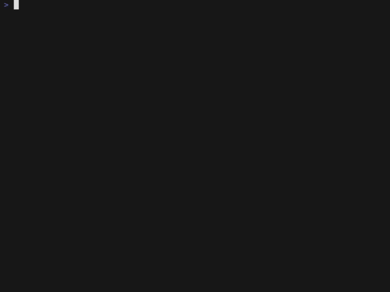
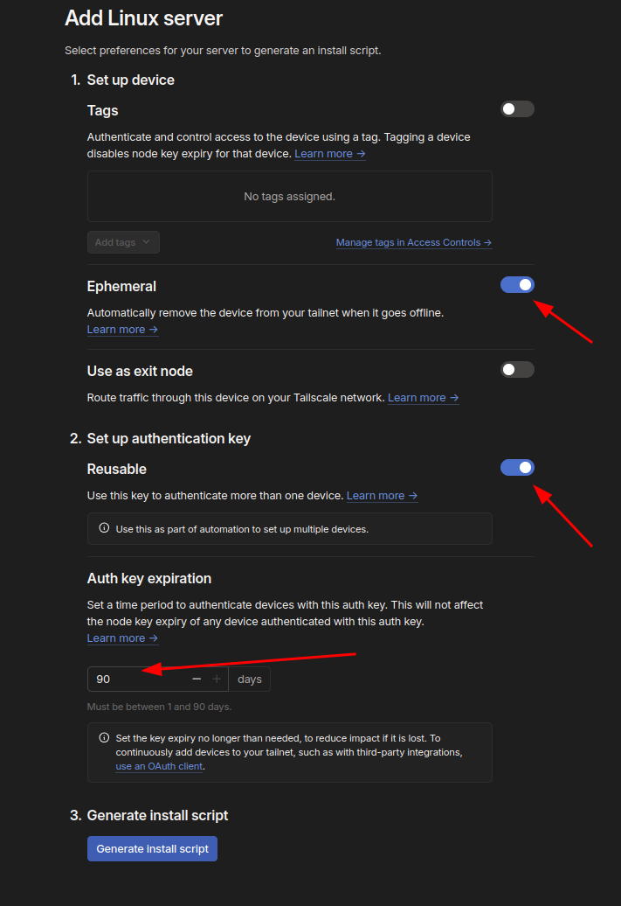

# tsgrok

[](https://goreportcard.com/report/github.com/jonson/tsgrok)
[](https://opensource.org/licenses/MIT)

**Expose local http services using Tailscale via an interactive Terminal UI.**

`tsgrok` provides a convenient way to create and inspect [ephemeral](https://tailscale.com/kb/1111/ephemeral-nodes) [Tailscale Funnels](https://tailscale.com/kb/1223/funnel) directly from your terminal.

## Demo




## Why `tsgrok`?

While the `tailscale funnel` command is powerful, managing multiple funnels is challenging.  `tsgrok` takes a different approach, creating a disposable ephemeral node in your tsnet for each funnel you create, and destrorying it when the app is closed.

*   **Visibility:** See all your funnels and their status at a glance.
*   **Ease of Use:** A dedicated TUI simplifies common actions like creation, deletion, and URL copying.
*   **Request Inspection:** Quickly check if traffic is hitting your funnel without needing separate logging.
*   **Disposable:** Each funnel is created on distinct ephemeral node, all of which live in memory and are destroyed when the app is terminated.  Orphaned ephemeral nodes are automatically cleaned up by Tailscale.


## Installation

### Releases
See the [releases](https://github.com/jonson/tsgrok/releases) page for the latest release.  Binaries are provided for major platforms.

### Go
The easiest way to install `tsgrok` is using `go install`:

```bash
go install github.com/jonson/tsgrok@latest
```

Make sure your Go environment variables (`GOPATH`, `GOBIN`) are set up correctly so the installed binary is in your system's `PATH`.

## Usage

Simply run the command:

```bash
tsgrok
```

## Tailscale Auth

`tsgrok` is a standalone application that does not rely on Tailscale being installed on the machine running it.  Rather, it relies on an auth key to
provision and manage ephemeral nodes.  You should provision an auth key, something like the following:



This must be set in the environment variable TSGROK_AUTHKEY, and it should be of the format `tskey-auth-...`.

Flags to consider when creating your auth key:
* Tags: You can automatically tag any nodes created by tsgrok, and add further restrictions in the ACL if desired.  Tags are not necessary however.
* Ephemeral: `tsgrok` will only create ephemeral nodes, but you can toggle this to guarantee this is the case.
* Reusable: This key nees to be reusable, else you will only be able to create one funnel!
* Expiration: Set to whatever you desire.

## Contributing

Contributions are welcome! If you find a bug or have a feature request, please open an issue on GitHub. If you'd like to contribute code, please open a pull request.

## License

This project is licensed under the **MIT License**. See the [LICENSE](LICENSE) file for details.
